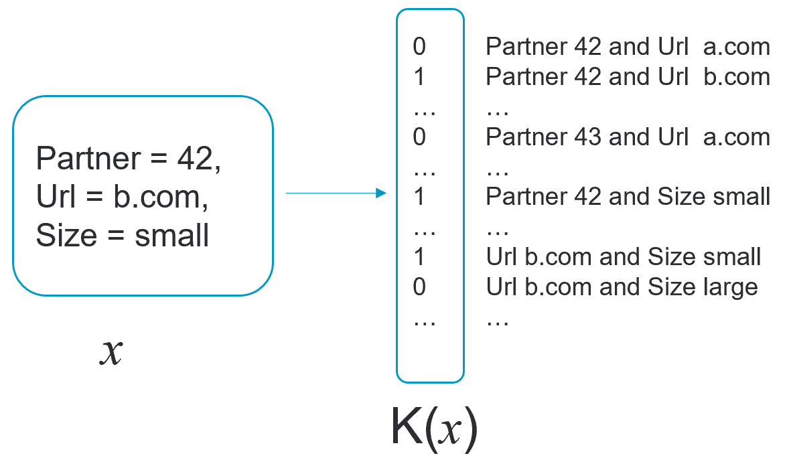

# Learning a click prediction model from noisy aggregated data

- This page describes an algorithm which could be used to learn a model from noisy aggregated data. 
A [more detailed article version](https://www.adkdd.org/Papers/Learning-a-logistic-model-from-aggregated-data/2021) as been accepted at [AdKDD 2021](https://www.adkdd.org/Papers) 
- This repository also contains the notebook and code to re-run the experiments presented in the paper.

## Aggregated data

### Ad click prediction and privacy sandbox
Currently advertisers heavily rely on datasets containing numerous features describing past displayed ads and labels such as "the ad is clicked" or "the ad is followed by a conversion". Those datasets are used to train models predicting the probability of a click or a sale from the features of the ad, with classical supervised learning techniques.
The advertising market is now moving to provide more privacy to users. In this context, a likely scenario would prevent advertisers to access directly the training dataset, but would instead allow them to get noisy aggregated views of the dataset.
However, using noisy aggregated data to learn a good quality model is a challenging task, because typical supervised learning methods require the unaggregated data.


### Aggregated data 

The aggregated data consists on the results of several queries (also called "contingency tables") counting the number of examples and the sum of labels on several projections of the original unaggregated dataset. 

#### Example

For example, a table projecting on the features "PartnerId" and "url" would look like this:

| PartnerId | url | count of displays | count of clicks (ie sum of labels) |
| --- | --- | --- | ---  |
| 42 | someurl.com | 10000  | 600 |
| 42 | someurl.com | 55000  | 1000 |
| 43 | anotherurl.com | 20000  | 500 |
| ...  | ... | ...  | ... |

This table is the result of the query
```
Select  PartnerId, url, count, sum(label)
    from dataset
    group by feature1, feature2 
```

Some other tables on the same dataset could look like this:

| PartnerId | AdSize | count of displays | count of clicks (ie sum of labels) |
| --- | --- | --- | ---  |
| 42 | large | 700000  | 8000 |
| 42 | small | 100000  | 1000 |
| 43 | large |  900000 | 10000 |
| ...  | ... | ...  | ... |

or like this:

| url | AdSize | count of displays | count of clicks (ie sum of labels) |
| --- | --- | --- | ---  |
| someurl.com | large | 300000  | 2000 |
| someurl.com | small | 40000  | 500 |
| anotherurl.com | large |  200000 | 4000 |
| ...  | ... | ...  | ... |

#### Predicting click from aggregated data

From the tables above, it is quite straigforward, using the first table, to build a model predicting:
> Probability ( click = 1 | Parner, url ) 

Or to predict instead, using table 2,
> Probability ( click = 1 | Parner, adsize ) 

Our goal here is to (try to) get a model predicting the label as a function of all the avaible features, using only a list of aggregated tables as those of the example above. In the case of the example, it means we would like to predict:
> Probability ( click = 1 | Parner, url, adsize) 

#### A word of caution
Let us warn here that the method we propose does not have theorical garantees on the quality of the produced model, and migth actually fail to produce a "good" model on some dataset with very strong high-level correlations between the features.
We however found it to perform rather well on the real world datasets we experimented with, which included some higthly correlated features.

### Notations and formalization

We note x<sub>i</sub>, y<sub>i</sub> the feature vectors and labels of the (unobserved) dataset.

Each line of the aggregated tables may be characterized by a binary function, which takes value 1 if example x is counted in this line, and 0 otherwise. 
For instance, the first line of the first table in examples above woud be associated to the function which takes value 1 on examples where the partner is 42 and the url is "someurl.com"; and value 0 on all other examples.

We note K(x) ∈ {0;1}<sup> number of lines </sup>  the function  obtained by concatenating the functions associated to every line of every available table.  The image below shows K this in the case of previous example:



With our notation, the "count" and the "sum of labels" in the tables are the following vectors:
> d := sum <sub>i</sub> K(x<sub>i</sub>)   
> c := sum <sub>i</sub> y<sub>i</sub>.K(x<sub>i</sub>)   

(ie d is the vector obtained by concatening the "count" column of every table, while c is obtained by contatenating the "sum of labels" ). 

#### Projections on all pairs of features

In the experiments we did, the aggregated data were the results of one query counting displays and label sums on modalities of each pair of feature (Similar to the 3 queries of the example above)

### Noise injection

To provide some privacy guarantees, (such as epsilon differential privacy), noise - typically i.i.d. Gaussian or Laplace - may be added to the counts.
While the algorithm we describe here may account for this noise, we would like to emphasis here that the problem is already challenging when there is no additional noise.

#### Projections on pairs and on single features
In the noisy case, our aggregated data also included the (noisy) counts on modalities of each single feature. (Note that this might be recomputed from the queries on pairs by re-aggregating, but the re-aggregated counts would have a higher level of noise than what we get by runnning the queries directly.)

## Proposed model

As we cannot apply classical ML methods to model the probability P(Y|X) of having a positive label knowing the features, we propose  to model instead the joint distribution on X and Y.
The model we suggest is the following "Markov random field":

> P(X=x, Y=y) = exp( K(x).μ + y * K(x).θ) / Z
where:
- θ and μ are vectors of parameters. ( of the same size as K(x) ) 
- Z is a normalization constant.

### Conditional law on Y

It is straigforward to check that, according to the model defined above:

> P(Y=y | X=x) = sigmoid( K(x).θ)

The (intractable) normalization constant Z disappered, and it is worth noting that the shape of this model looks like a logistic regression with features K(x). A true logistic regression however requires the full disaggregate data set.  The logistic regression learnt on the unaggregated dataset is thus a natural 'skyline' for assessing the performances of the model learnt on the aggregated data.

### Loglikelihood of the aggregated data

We would like to fit the model by choosing parameters θ and μ maximizing the likelihood of the aggregated dataset, assuming each individual examples of the original data are iid samples from the model. Formally, we would like to retrieve the parameters  μ, θ maximising the folowing log-likelihood:

> llh( d,c, μ, θ) := Log Probability( D = d, C = c | μ, θ ) 

Here we noted D the vector random variable defined as "the counts of aggregated displays, when the dataset is made of iid samples from the model defined above"; and likewise C is the random variable made of counts of aggregated clicks.

The associated optimization problem may be intractable for arbitrary models, but is more managable with the specific choice of parametric model defined above. This is the case because this model form an [exponential familly](https://en.wikipedia.org/wiki/Exponential_family), whose sufficient statistics are exactly the available aggregated data.

### Gradient of the loglikelihood

We can indeed show that the gradients on μ and θ of the logikelihood are:
> Grad<sub>μ</sub>  (llh) =  d - E(D)   
> Grad<sub>θ</sub>  (llh) =  c - E(C)   

where :
- d and c are the vectors of aggregated counts and aggregated sum of labels
- E(D) and E(C) are the expectation of aggregated counts and sum of labels. Those expectations are computed according to the probability distribution given by the current estimation of the model.

### Computing the gradient

To fit this model, the main difficulty is the estimation of the expectations E(D) and E(C) under the model parameters.
While expensive, the following scheme may be used to estimate those terms:
- draw some samples of the model, for example using [Gibbs sampling](https://en.wikipedia.org/wiki/Gibbs_sampling)
- use a Monte Carlo estimator built from those samples (Note that each component of D follows a binomial: we do not need several samples of D)

In practice, we used the [Persistent contrastive divergence](https://www.cs.toronto.edu/~tijmen/pcd/pcd.pdf) to limit the computation cost of the Gibbs samples, and marginalized with respect to Y in the our Monte Carlo estimator - see the paper for details.

### Noisy aggregated data

If we know the distribution of the noise, we can include the noise in the model: the loss is now the loglikelihood of observing the noisy aggregated data, knowing that the examples are iid samples from the model and that the noise was added. 
The resulting model is known as a [Collective graphical models](https://papers.nips.cc/paper/2011/file/fccb3cdc9acc14a6e70a12f74560c026-Paper.pdf), and advanced method have already been proposed to fit such models. In our experiments, we used a cruder but easier to implement approximation (see the full paper for details) than what is found in the litterature, because our focus was the ability to learn P(Y|X) on large scale datasets.

## Experiments

### Medium sized dataset

The experiments detailed in the paper have been made on a medium sized public advertising dataset previously released by Criteo, with 11 features and 16M examples.
The dataset was split in train and test, and the train was aggregated, counting displays and clicks on each pair of feature. The aggregated data are thus the results of about 50 distinct queries.

#### Running the experiments

Experiments on this dataset are detailed in the AdKDD paper, and this repository contains the code to run them. See the content of the notebook folder.
(Most experiments are made on a small subset of the dataset and run in a few minutes. Please note however that experiments on the full dataset may be prohibitively slow.)

#### Results 

See the paper for details. To summarize, on this dataset we get results which not too far from those of a logistic regression with a quadratic kernel and access to the whole unaggregated dataset.

### Criteo Privacy Preserving ML Competition @ AdKDD

To raise community awareness on the topic of learning from aggregated data, we ran a [public challenge](https://www.adkdd.org/2021-privacy-ml-competition) at AdKKD2021.
The competition was hosted on [codalab](https://competitions.codalab.org/competitions/31485).
The goal on this competition is similar to this work: learning a click prediction model, from aggregated data as described above.
However, the competition also included two sets of unaggregated data:
 - A small granular - ie with one line for each sample, as is the usual case in ML -  labelled training set, provided to keep the competition easy to access.
 - A medium-sized test set of granular unlabelled data.
 Using either of those datasets seems critical in top performing solutions, and the method we presented here - based  on aggregated data only - was quite far behind. We are however not (yet?) aware of any better performing model using aggregated data only.
 

Model | % explained entropy  (*) 
--- | --- 
Logistic regression  <br> with quadratic kernel, 100M samples <br> ( "oracle" on the leaderboard ) |  0.31
Challenge winners |  0.295
This work | 0.265
Logistic regression  <br> with 100K samples (small train set) |  0.24


(*) Also called  "Improvement vs Naive" in the competition leaderboard. Formula is:  1 - LLH / Entropy. 


We think the mild performances of our model on this dataset, compared to the first dataset we experimented on, would be explained by the presence of highly predictive, high cardinality, stronly correlated features. Those features mean that:
- an accurate model of P(X) seem necessary to achieve good performances
- the P(X) model we use is difficult to train accurately.
We do not know yet if the main limitation is the modelization error made on P(X), or the optimization error.


## Conclusion

While we obtained promising results on a medium sized dataset, the mild results on Criteo Adkdd Challenge outlines that our method seems still difficult to apply on large scale datasets. 
More research will be required to determine whether it may be successfully adapted at the scale of the online advertising industry.
